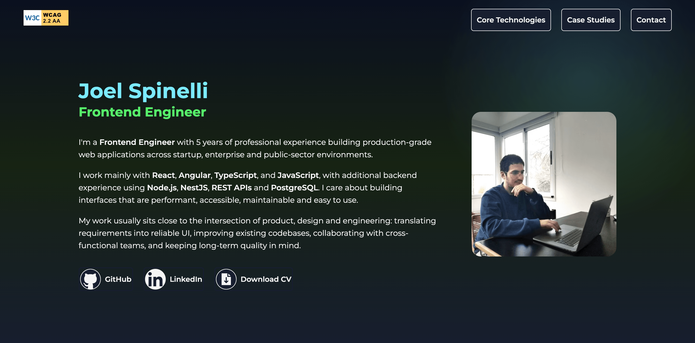
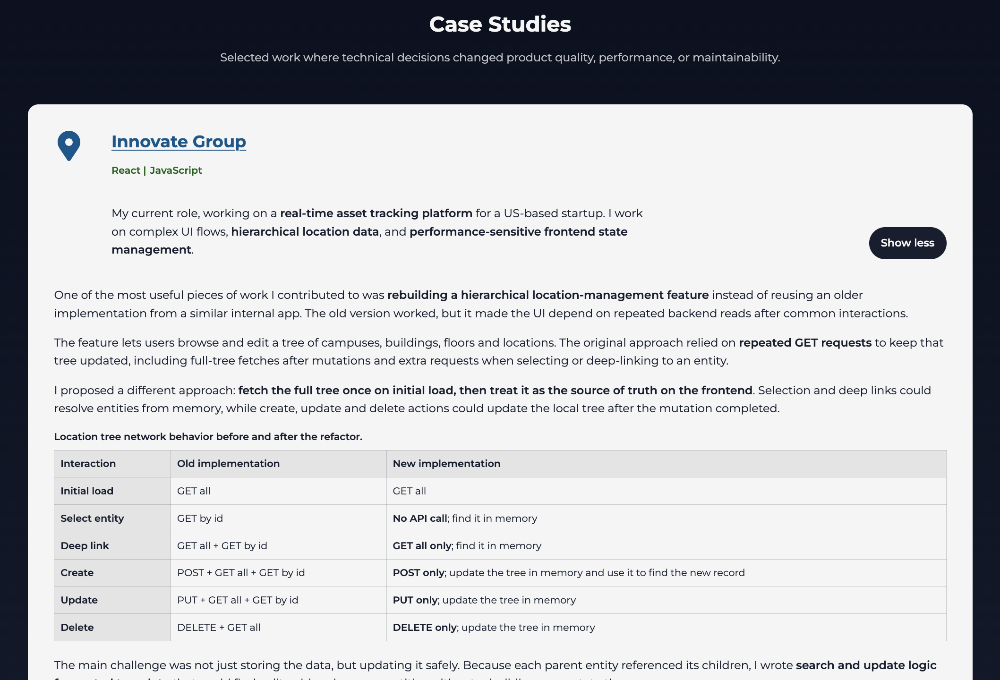
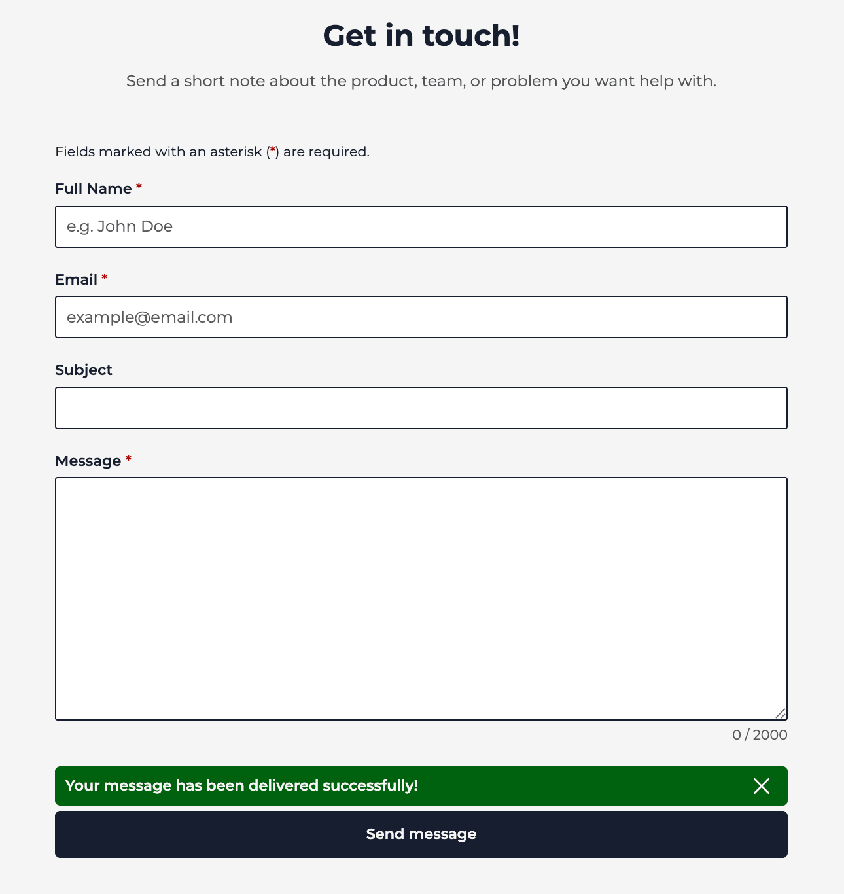

# Joel Spinelli Portfolio

Full-stack portfolio site for presenting my frontend engineering experience, selected case studies, core technologies, and a working contact flow.

The project is split into a React/Vite frontend and a small Express API. The frontend focuses on accessible, responsive UI and case-study content. The backend handles contact-form delivery through Resend with request validation, CORS configuration, and Swagger docs in non-production environments.

Live site: [joel-spinelli.com](https://joel-spinelli.com/)

## Preview



| Expanded case study | Contact form |
| --- | --- |
|  |  |

## What It Shows

- Production-style React + TypeScript component structure.
- Fully responsive portfolio UI with mobile navigation.
- Accessible interaction patterns that meet WCAG 2.2 AA standards: semantic sections, keyboard-friendly menu behavior, focus handling, live status messaging, visible validation errors, and reduced-motion support.
- Real-life case studies that explain technical decisions around performance, maintainability, and accessibility.
- Contact form with client-side validation, loading/success/error states, and duplicate-submit protection.
- Express email API with server-side validation, safe generic error responses, invalid JSON handling, and tested route behavior.

## Tech Stack

**Frontend:** React, TypeScript, Vite, Sass, Framer Motion, Vitest, Testing Library, ESLint  
**Backend:** Node.js, Express, TypeScript, Resend, Swagger UI, Vitest, Supertest  
**Package manager:** pnpm

## Project Structure

```txt
frontend/
  src/
    components/      React components and SCSS
    services/        Contact API client
    hooks/           Shared frontend hooks
  public/            Fonts, profile image, technology icons

backend/
  src/
    routes/          Express routes
    services/        Resend email integration
    validators/      Request validation
    utilities/       Swagger spec creation
```

## Local Setup

Install dependencies separately because the frontend and backend each have their own workspace.

```sh
cd frontend
pnpm install

cd ../backend
pnpm install
```

Create environment files:

```sh
# frontend/.env
VITE_SERVER_URL=http://localhost:3000

# backend/.env
ALLOWED_ORIGIN=http://localhost:5173
RESEND_API_KEY=your_resend_api_key
RESEND_FROM_EMAIL=your_verified_sender@example.com
RESEND_TO_EMAIL=your_destination_email@example.com
PORT=3000
```

Run the backend:

```sh
cd backend
pnpm dev
```

Run the frontend in another terminal:

```sh
cd frontend
pnpm dev
```

Open the Vite local URL shown in the terminal. In development, API docs are available at:

```txt
http://localhost:3000/api-docs
```

## Available Scripts

Frontend:

```sh
pnpm dev
pnpm build
pnpm lint
pnpm test
pnpm test:coverage
```

Backend:

```sh
pnpm dev
pnpm build
pnpm test
```

## API

`POST /mail`

Sends a portfolio contact message.

Request body:

```json
{
  "name": "Jane Doe",
  "email": "jane@example.com",
  "subject": "Portfolio contact",
  "message": "Hello, I would like to talk about a role."
}
```

Responses:

- `204`: message sent.
- `400`: validation or JSON parsing error.
- `500`: email provider failure, returned as a generic public error.

## Testing

The test suite covers:

- Contact-form rendering, validation, submit states, and duplicate-submit prevention.
- Frontend contact service request and error handling.
- Backend request validation.
- Mail route success, validation failures, and safe server errors.
- App-level CORS, invalid JSON handling, and Swagger availability outside production.

## Third-Party Assets

Technology names, logos, and trademarks belong to their respective owners.
Some interface icons were sourced from [SVG Repo](https://www.svgrepo.com/).
